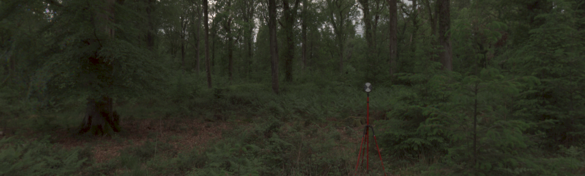
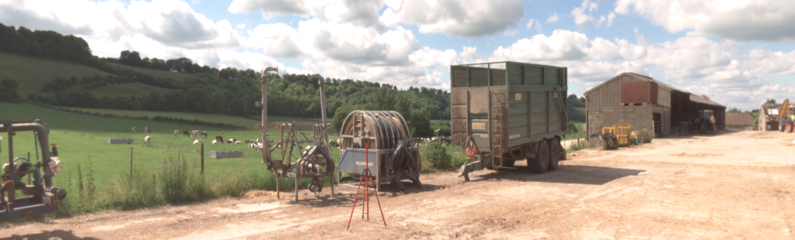
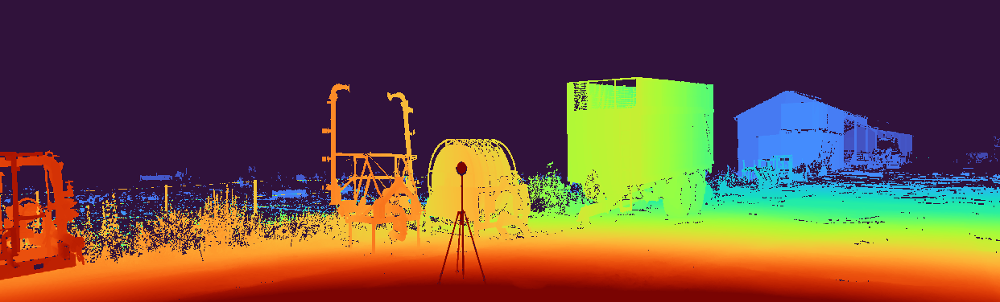
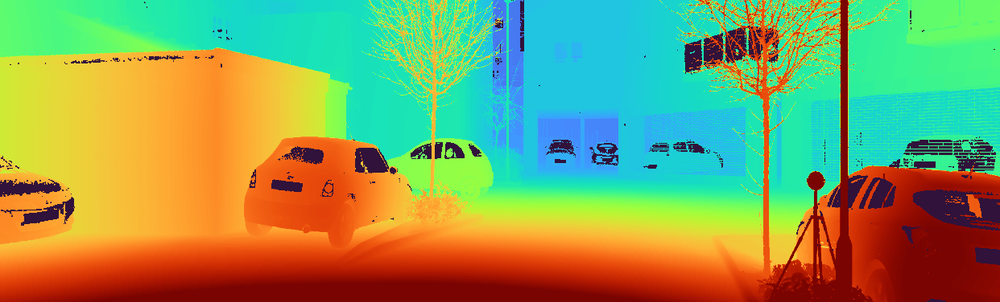

# Deconstructing Self-Supervised Monocular Reconstruction: The Design Decisions that Matter

---

This repository contains the code associated with the publication

> **Deconstructing Self-Supervised Monocular Reconstruction: The Design Decisions that Matter**
>
> [Jaime Spencer](https://www.surrey.ac.uk/people/jaime-spencer-martin), 
> [Chris Russell](https://www.amazon.science/author/chris-russell), 
> [Simon Hadfield](http://personal.ee.surrey.ac.uk/Personal/S.Hadfield) 
> and 
> [Richard Bowden](http://personal.ee.surrey.ac.uk/Personal/R.Bowden/)
>
> [ArXiv 2022](https://arxiv.org/abs/2208.01489) (Under Review)

> We are currently also organizing a monocular depth prediction challenge around the proposed SYNS-Patches dataset! 
> This challenge will take place at [MDEC@WACV2023](https://jspenmar.github.io/MDEC/).
> Please check the website for details!

<p align="center">



 



</p>

---

## Project Structure
- [`.git-hooks`](./.git-hooks): Dir containing a pre-commit hook for ignoring Jupyter Notebook outputs.
- [`api`](./api): Dir containing main scripts for training, evaluating and data preparation.
- [`assets`](./assets) Dir containing images used in README. 
- [`cfg`](./cfg) Dir containing config files for training/evaluating.
- [`docker`](./cfg) Dir containing Dockerfile and Anaconda package requirements.
- [`data`](./data)*: (Optional) Dir containing datasets.
- [`hpc`](./hpc): (Optional) Dir containing submission files to HPC clusters.
- [`models`](./models)*: (Optional) Dir containing trained model checkpoints.  
- [`src`](./src): Dir containing source code.
- [`tests`](./tests): Dir containing codebase tests (pytest).
- [`.gitignore`](./.gitignore): File containing patterns ignored by Git.
- [`PATHS.yaml`](./PATHS.yaml)*: File containing additional data & model roots.
- [`README.md`](./README.md): This file!

`*` Not tracked by Git!

---

## Getting Started
For instructions on using this code, please refer to the respective READMEs:
- [Dataset Downloading](./api/data/README.md)
- [Training](./api/train/README.md)
- [Evaluating](./api/eval/README.md)
- [Source Code](./src/README.md)

Make sure to add the root path of this repository to `PYTHONPATH` to ensure the code is found.
In `bash` this can be done by adding `export PYTHONPATH=/path/to/monodepth_benchmark/:$PYTHONPATH` to your `~/.bashrc` file.

### PYTHONPATH
Remember to add the path to the repo to the `PYTHONPATH` in order to run the code.
```shell
# Example for `bash`. Can be added to `~/.bashrc`.
export PYTHONPATH=/path/to/monodepth_benchmark:$PYTHONPATH
```

### Git Hooks
First, set up a GitHub pre-commit hook that stops us from committing [Jupyter Notebooks](https://jupyter.org) with outputs, 
since they may potentially contain large images.
```shell
./.git-hooks/setup.sh
chmod +x .git/hooks/pre-commit  # File sometimes isn't copied as executable. This should fix it. 
```

### Anaconda
If using [Miniconda](https://docs.conda.io/en/latest/miniconda.html), create the environment and run commands as
```shell
conda env create --file docker/environment.yml
conda activate
python api/train/train.py ...
```

### Docker
To instead build the [Docker](https://www.docker.com) image, run
```shell
docker build -t monoenv ./docker
docker run -it \
    --shm-size=24gb \
    --gpus all \
    -v $(pwd -P):$(pwd -P) \
    -v /path/to/dataroot1:/path/to/dataroot1 \
    --user $(id -u):$(id -g) \
    monoenv:latest \
    /bin/bash

python api/train/train.py ...
```

### Tests
You can run the available `pytest` tests as `python -m pytest`.
Please note they are not extensive and only cover parts of the library.
However, [these](./tests/test_data) can be used to check if the datasets have been installed and preprocessed correctly.

### Paths
The default locations for datasets and model checkpoints are `./data` & `./models`, respectively.
If you want to store them somewhere else, you can either create [symlinks]( https://man7.org/linux/man-pages/man2/symlink.2.html) to them, or add additional roots.
This is done by creating the `./PATHS.yaml` file with the following contents:

```yaml
# -----------------------------------------------------------------------------
MODEL_ROOTS: 
  - /path/to/modelroot1

DATA_ROOTS:
  - /path/to/dataroot1
  - /path/to/dataroot2
  - /path/to/dataroot3
# -----------------------------------------------------------------------------
```

> **NOTE:** Multiple roots may be useful if training in an HPC cluster where data has to be copied locally.  

Roots should be listed in order of preference, i.e. `dataroot1/kitti_raw_syns` will be given preference over `dataroot2/kitti_raw_syns`.


---
  
## Citation
If you used the code in this repository or found the paper interesting, please cite it as
```text
@article{Spencer2022,
  title={Deconstructing Self-Supervised Monocular Reconstruction: The Design Decisions that Matter},
  author={Spencer, Jaime and Russell, Chris and Hadfield, Simon and Bowden, Richard},
  journal={arXiv preprint arXiv:2208.01489},
  year={2022}
}
```

---
  
## References
We would also like to thank the authors of the papers below for their contributions and for releasing their code. 
Please consider citing them in your own work.

| Tag           | Title                                                                                                    | Author              | Conf      | ArXiv                                                                                                             | GitHub                                                               |
|---------------|----------------------------------------------------------------------------------------------------------|---------------------|-----------|-------------------------------------------------------------------------------------------------------------------|----------------------------------------------------------------------|
| Garg          | Unsupervised CNN for Single View Depth Estimation: Geometry to the Rescue                                | Garg et. al         | ECCV 2016 | [ArXiv](https://arxiv.org/abs/1603.04992)                                                                         | [GitHub](https://github.com/Ravi-Garg/Unsupervised_Depth_Estimation) |
| Monodepth     | Unsupervised Monocular Depth Estimation with Left-Right Consistency                                      | Godard et. al       | CVPR 2017 | [ArXiv](https://arxiv.org/abs/1609.03677)                                                                         | [GitHub](https://github.com/mrharicot/monodepth)                     |
| Kuznietsov    | Semi-Supervised Deep Learning for Monocular Depth Map Prediction                                         | Kuznietsov et. al   | CVPR 2017 | [ArXiv](https://arxiv.org/abs/1702.02706)                                                                         | [GitHub](https://github.com/Yevkuzn/semodepth)                       |
| SfM-Learner   | Unsupervised Learning of Depth and Ego-Motion from Video                                                 | Zhou et. al         | CVPR 2017 | [ArXiv](https://arxiv.org/abs/1704.07813)                                                                         | [GitHub](https://github.com/tinghuiz/SfMLearner)                     |
| Depth-VO-Feat | Unsupervised Learning of Monocular Depth Estimation and Visual Odometry with Deep Feature Reconstruction | Zhan et. al         | CVPR 2018 | [ArXiv](https://arxiv.org/abs/1803.03893)                                                                         | [GitHub](https://github.com/Huangying-Zhan/Depth-VO-Feat)            |
| DVSO          | Deep Virtual Stereo Odometry: Leveraging Deep Depth Prediction for Monocular Direct Sparse Odometry      | Yang et. al         | ECCV 2018 | [ArXiv](https://arxiv.org/abs/1807.02570)                                                                         |                                                                      |
| Klodt         | Supervising the new with the old: learning SFM from SFM                                                  | Klodt & Vedaldi     | ECCV 2018 | [CVF](https://openaccess.thecvf.com/content_ECCV_2018/papers/Maria_Klodt_Supervising_the_new_ECCV_2018_paper.pdf) |                                                                      |
| MonoResMatch  | Learning monocular depth estimation infusing traditional stereo knowledge                                | Tosi et. al         | CVPR 2019 | [ArXiv](https://arxiv.org/abs/1904.04144)                                                                         | [GitHub](https://github.com/fabiotosi92/monoResMatch-Tensorflow)     |
| DepthHints    | Self-Supervised Monocular Depth Hints                                                                    | Watson et. al       | ICCV 2019 | [ArXiv](https://arxiv.org/abs/1909.09051)                                                                         | [GitHub](https://github.com/nianticlabs/depth-hints)                 |
| Monodepth2    | Digging Into Self-Supervised Monocular Depth Estimation                                                  | Godard et. al       | ICCV 2019 | [ArXiv](https://arxiv.org/abs/1806.01260)                                                                         | [GitHub](https://github.com/nianticlabs/monodepth2)                  |
| SuperDepth    | SuperDepth: Self-Supervised, Super-Resolved Monocular Depth Estimation                                   | Pillai et. al       | ICRA 2019 | [ArXiv](https://arxiv.org/abs/1810.01849)                                                                         | [GitHub](https://github.com/ToyotaResearchInstitute/superdepth)      |
| Johnston      | Self-supervised Monocular Trained Depth Estimation using Self-attention and Discrete Disparity Volume    | Johnston & Carneiro | CVPR 2020 | [ArXiv](https://arxiv.org/abs/2003.13951)                                                                         |                                                                      |
| FeatDepth     | Feature-metric Loss for Self-supervised Learning of Depth and Egomotion                                  | Shu et. al          | ECCV 2020 | [ArXiv](https://arxiv.org/abs/2007.10603)                                                                         | [GitHub](https://github.com/sconlyshootery/FeatDepth)                |
| CADepth       | Channel-Wise Attention-Based Network for Self-Supervised Monocular Depth Estimation                      | Yan et. al          | 3DV 2021  | [ArXiv](https://arxiv.org/abs/2112.13047)                                                                         | [GitHub](https://github.com/kamiLight/CADepth-master)                |
| DiffNet       | Self-Supervised Monocular Depth Estimation with Internal Feature Fusion                                  | Zhou et. al         | BMVC 2021 | [ArXiv](https://arxiv.org/abs/2110.09482)                                                                         | [GitHub](https://github.com/brandleyzhou/DIFFNet)                    |
| HR-Depth      | HR-Depth: High Resolution Self-Supervised Monocular Depth Estimation                                     | Lyu et. al          | CAI 2021  | [ArXiv](https://arxiv.org/abs/2110.09482)                                                                       | [GitHub](https://github.com/shawLyu/HR-Depth)                        |

---

## Licence
This project is licenced under the `Commons Clause` and `GNU GPL` licenses.
For commercial use, please contact the authors. 

---
